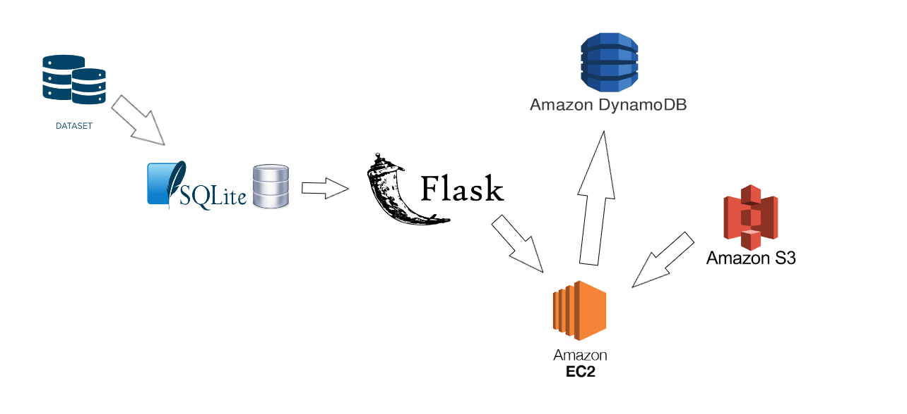

# GymGenius - Your Ultimate Fitness Companion
## Overview
Welcome to GymGenius, a dynamic sports-centric website designed to guide individuals in the early stages of their fitness journey. GymGenius aims to create a comfortable environment for users by offering a diverse range of 1300 exercises sourced from a carefully curated dataset.

## Features
**Extensive Exercise Database:** Access a comprehensive collection of 1300 exercises to tailor your fitness routine. 

**Efficient ETL Processes:** Implemented efficient Extract, Transform, Load (ETL) processes for seamless data integration into an SQLite database, ensuring a robust foundation for the platform.  

**Flask for Web Development:** Leveraged Flask for web uploads, showcasing strong system administration skills, and successfully deployed the application on an EC2 Linux instance.  

**API Integration for Nutrition:** Enhanced user functionality by integrating a nutritional calculator through an API, providing users with a holistic approach to their fitness journey.  

**DynamoDB for Data Organization:** Implemented DynamoDB for organized daily exercise view categorization, optimizing data management and ensuring a user-friendly experience.  

**Pandas for Data Analysis:** Utilized pandas for insightful data analysis, identifying trends and popular exercises, contributing to the creation of a comprehensive fitness platform.  

## Technologies Used
* Flask
* SQLite
* API Integration
* DynamoDB
* Pandas

## Link
[GymGenius](https://23.21.0.65:5000)

## Structure

## Contact
If you have any questions or concerns, please don't hesitate to contact us at: shani.ifrach12@gmail.com.

**Thank you for choosing GymGenius as your fitness companion!**
